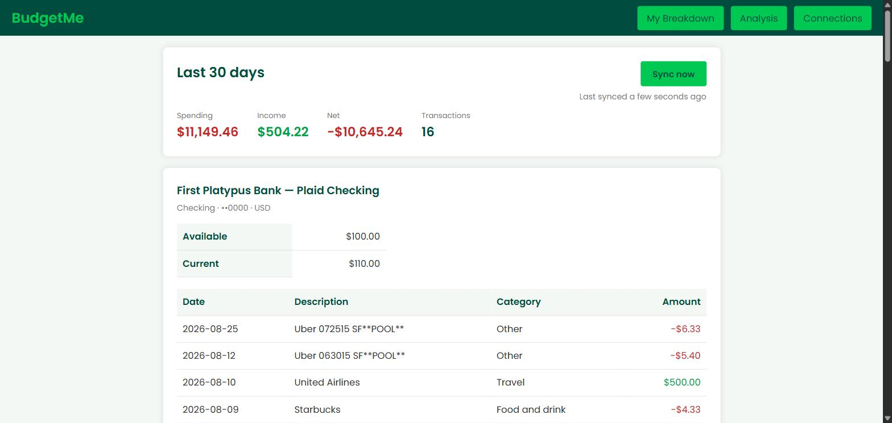

# BudgetMe


A small **local** dashboard for your bank accounts. Link one or more banks
through [Plaid](https://plaid.com), and BudgetMe pulls your balances and
transactions into a local SQLite file and shows you where the money goes — one
account view, one analysis view. Single user, runs on your machine, no server.

Started as a "sunhacks" hackathon project; originally built on Teller.io, which
withdrew its API in July 2026, then migrated to Plaid.



## Requirements

- Python 3.10+ (developed on 3.13)
- A free Plaid account for API keys (no credit card)

## Setup

```bash
python -m venv .venv
.venv\Scripts\Activate.ps1        # Windows PowerShell
# source .venv/bin/activate       # macOS / Linux

pip install -r requirements.txt
copy .env.example .env            # cp on macOS / Linux
```

Then get Plaid keys:

1. Sign up at <https://dashboard.plaid.com/signup> — instant, no card.
2. At <https://dashboard.plaid.com/developers/keys>, copy your **Client ID** and
   your **Sandbox** secret.
3. Put them in `.env` as `PLAID_CLIENT_ID` / `PLAID_SECRET` (leave
   `PLAID_ENV=sandbox`).

## Run

```bash
python run.py          # http://127.0.0.1:8000
```

1. You'll be sent to **Connect your bank**. Click **Open Bank Login**.
2. In Plaid Link, pick **First Platypus Bank** and use the sandbox credentials:
   username `user_good`, password `pass_good` (SMS/OTP code `1234` if asked).
3. You land on **My Breakdown** — accounts, balances, a 30-day summary, and
   recent transactions. **Sync now** pulls anything new from Plaid. **Analysis**
   breaks spending down by category, month, and merchant. **Connections** lets
   you add another bank or disconnect one.

Sandbox transactions can take a few seconds to appear on the first sync; hit
**Sync now** or refresh.

### Check your keys without the browser

```bash
python plaid_probe.py
```

Mints a sandbox token, prints the accounts and transactions. Doesn't touch the
database.

## Sandbox vs. real data

Out of the box `PLAID_ENV=sandbox` shows **fake data** (First Platypus Bank).
Seeing *your real accounts* needs Plaid **Production** access, which requires an
application Plaid reviews; the free "Limited Production" tier is ~200 API calls
per product. For a personal tool that's a real ceiling — worth knowing before
you point it at your own bank. See <https://plaid.com/docs/>.

## Security

- Your Plaid access token and all synced account/transaction data live in
  **`instance/budgetme.db`** — a plain, unencrypted SQLite file. It's
  git-ignored. Keep it (and `.env`) private.
- The access token is read-only (it can't move money) but it *can* read your
  financial data. Treat it like a password.
- Run this **locally**. If you host it, you take on HTTPS, a hardened
  `SECRET_KEY` (required when `FLASK_DEBUG=0`), cookie flags, and the host itself
  entering your trust boundary — see the design notes below.
- This is a personal project, not audited.

## Architecture

```
run.py                 entry point (HOST / PORT / FLASK_DEBUG from env)
budgetMe/
  budget.py            Flask routes — read/write the store, call plaid_api, render
  plaid_api.py         Plaid HTTP client: token dance, sync_transactions(), shapers
  store.py             SQLite data layer: connection / account / txn tables
  analytics.py         pure functions — summary() and report() over stored txns
  templates/           base.html + breakdown / analysis / connections / login
  static/style.css     shared styles
plaid_probe.py         standalone sandbox probe (no DB)
tests/                 test_store.py, test_analytics.py, test_breakdown.py
```

**Data flow.** Plaid Link (browser) returns a short-lived `public_token`;
`POST /login` exchanges it for a long-lived `access_token`, stores a `connection`
row, and runs an initial sync. A sync = `GET /accounts` + `/transactions/sync`
(cursor-based delta) → written to SQLite. `/breakdown` and `/analysis` then read
purely from SQLite, so pages load instantly and the data survives restarts.
`POST /sync` pulls only what changed.

**Amount sign.** Plaid reports `amount` as positive when money *leaves* an
account. `plaid_api.shape_transaction` flips it, so everywhere else negative =
spent, positive = received.

**Multi-bank.** Each linked institution is one `connection`; `/breakdown` and
`/analysis` aggregate across all of them. If one connection needs re-linking the
others still work, and a warning card points you to reconnect.

## Routes

| Route | Purpose |
|---|---|
| `GET /` | redirects to `/breakdown` |
| `GET/POST /login` | GET issues a Plaid link token; POST exchanges the public token, stores the connection, initial sync |
| `GET /breakdown` | 30-day summary + every account with balances and recent transactions |
| `POST /sync` | incremental sync of every connection |
| `GET /analysis` | spending by category (chart + table), monthly cash flow, top merchants |
| `GET /connections` | linked banks, connect another, disconnect |
| `POST /connections/<id>/delete` | disconnect a bank (deletes its stored data) |

## Not built (deliberately)

Real charts beyond the one category doughnut · budgets / goals / alerts · user
accounts / multi-user / hosting · encryption of the local DB · investment or
loan analytics. It's a focused personal tool.

## Development

```bash
pip install -r requirements-dev.txt
ruff check .
python tests/test_store.py && python tests/test_analytics.py && python tests/test_breakdown.py
```

CI runs all three on every push.
